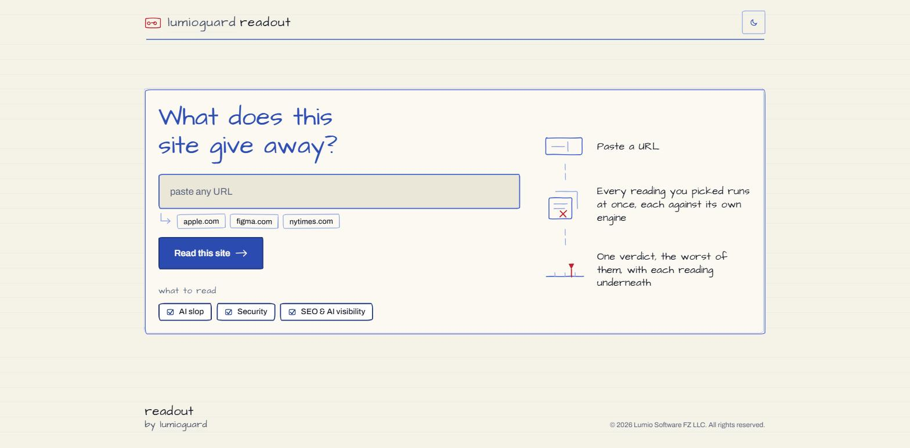

# LumioGuard Tools

**Paste a URL. Find out something true about the site.**

You shipped something. Maybe you built it fast, maybe an AI builder wrote most of
it. Three questions are worth asking before anyone else does:

**Does it look like everyone else's?**, **is it leaking?**, and **can the thing
that answers questions about your industry even read it?**

These are the tools that answer them, and they run from one page. Pick which
readings you want, paste an address, and every one you picked runs at once. No
sign-up, no access to your code, no connection to your database, no agent to
install. They read what your site already serves to the public, exactly as a
visitor would.



---

## One verdict, not three meters

Every score runs **0-100 where higher is better**, and three scores on one page
ask the reader which number is the answer. So the readings land on a **single
verdict: the worst of them**, never an average. A site is not two thirds fine
because two readings came back clean, and adding a reading it happens to pass
must not improve the number with nothing fixed.

[](apps/console)

Underneath, every finding from every reading is ranked together by **what it
cost the score**, which is the one thing findings from three unrelated engines
have in common. Then each reading gets its own section, with its own score in
its own words.

---

## Leakpeek: what is this app exposing?

Leakpeek reads your page and the JavaScript it ships. Where that JavaScript
points at a backend, it reads that too. Then it tells you what a stranger can
already reach.

[](tools/leakpeek)

The finding at the top of that report is the one that matters: a database table
returning rows to a request that never signed in. Not "you may have a
misconfiguration", but the actual read, the actual row count, the actual column
names. Something you can act on before breakfast.

It also finds API keys baked into your bundle, source maps you did not mean to
publish, `.env` files served from your web root, missing security headers, and
trackers running before anyone consented.

**It reads. It never writes.** No account is created, no row is changed, nothing
is deleted. And the report proves a hole without becoming one: it shows you that
1,240 rows came back and what the columns were called, never what was in them.

**[Read more →](tools/leakpeek)**

---

## Slopmeter: how much of this is still the template?

Slopmeter crawls a few pages and scores how closely your site's choices match the
defaults that generated sites ship with. Purple-blue gradients. Rounded cards in a
three-up grid. "Elevate your workflow." The things that make a hundred sites look
like one site.

[](tools/slopmeter)

Every point in the score comes with the reason it was scored, so you can disagree
with it. That is the point: a number you cannot see the reasons for is a number
you cannot argue with, and you should not trust one.

**It judges the page, never you and never your tools.** Which builder made the
site is reported and scores exactly zero. Something built with AI that somebody
actually designed comes out clean; a hand-coded page of stock defaults does not.

**[Read more →](tools/slopmeter)**

---

## Citecheck: can an answer engine cite this?

A growing share of the people who should be finding your site are asking a model
instead of typing a query. Citecheck reads your site the way one of those
crawlers does, asks again as one, and reports what stands between your pages and
being quoted.

The finding that catches most people is the first fetch: a page that is empty
until JavaScript runs. It looks perfect in a browser. Most crawlers that feed
answer engines do not run JavaScript, so what they store for that URL is a blank
document. The second is the bot filter you installed for scrapers, now returning
`403` to every agent that would have cited you.

[](tools/citecheck)

Absence is a choice, so it is flagged rather than priced. The reference pages
answer engines quote every day are missing several of these apiece: what costs
you is a signal that is there and does not work.

It also reads what `robots.txt` says to each of those crawlers, one row each.
**Turning one away is a decision, not a defect**, so that is listed and confirmed,
never corrected. What gets scored is a *contradiction*: an `llms.txt` inviting AI
readers beside a `robots.txt` turning them away, or a page your sitemap offers
and your robots.txt refuses.

**It reads past the front door.** The pages worth citing are almost never the
homepage, so a reading is a crawl, and anything found only behind the front door
is called out as such. That is where the `noindex` nobody meant to ship lives.

**[Read more →](tools/citecheck)**

---

## Try them

Hosted and free to use at
[lumioguard.dev/tools](https://lumioguard.dev/tools), or from a clone at
`http://127.0.0.1:5200` (see [Run them yourself](#run-them-yourself)). The app
is mounted at whichever address it is served from, so these paths are the same
either way:

| Path | What it does |
|---|---|
| `/` | Asks which reading you want, and sends you to the page that runs it |
| `/scan` | Every reading you tick, at once |
| `/ai-slop-check` | How much of the site came out of a template |
| `/security-check` | What the site is exposing to anyone with the URL |
| `/seo-ai-visibility-check` | Whether an answer engine can read it and quote it |

Paste a URL and every reading you picked runs at once, landing on a single
verdict: the **worst** of them, not an average. The three single readings carry
no picker, because the URL already answered what to read.

If you want something to point it at,
[leakpeek-demo.vercel.app](https://leakpeek-demo.vercel.app/) is a deliberately
broken app kept for exactly that. It is the site in every screenshot above.

**Only read a site you own, or one whose owner has asked you to.** Leakpeek
proves a finding by actually reading the target's backend, which is a real
request against someone else's infrastructure. See [SECURITY.md](SECURITY.md)
for what each tool does to a site, and how to report a flaw in them.

## Run them yourself

Everything here is MIT-licensed and runs on your own machine. Node 22+ and
pnpm 9+:

```bash
git clone https://github.com/lumioguard-dev/lumioguard-tools.git
cd lumioguard-tools
pnpm install
pnpm dev
```

That starts every tool:

| | Try it at | Its API |
|---|---|---|
| Console | http://127.0.0.1:5200 | (proxies each tool below) |
| Slopmeter | | http://127.0.0.1:8810 |
| Leakpeek | | http://127.0.0.1:8820 |
| Citecheck | | http://127.0.0.1:8830 |

Nothing else is required. No API keys, no accounts, no services to sign up for.
A fresh clone scans, scores and renders a full report out of the box.

The workspace packages are intentionally marked `private`: releases publish
source and deployable Workers, not npm packages. Consume them from a clone or a
Git dependency rather than expecting them on the npm registry.

## What is in here

```
apps/
  console/    the one front end. Reads a site with every tool you pick
    src/tools/
      slopmeter/   its client, its report panels and its ink
      leakpeek/    the same
      citecheck/   the same
packages/     what every tool shares: contracts, design tokens, the surface
tools/
  slopmeter/  core (the engine) · api (a Worker)
  leakpeek/   the same two
  citecheck/  the same two
```

Each tool is a detection engine and a Cloudflare Worker that feeds it. There is
**one** front end over all of them: three meters on one page ask the reader
which number is the answer, so the console draws a single verdict and each
tool's own score sits with its own section.

Adding a tool is a folder under `tools/` for the engine and the Worker, a folder
under `apps/console/src/tools/` for its surface, and one line in the console's
tool registry. Nothing else in the console names a tool, so the picker, the
consolidated score, the hand-off and the report all learn about it at once. That
is the whole reason this is a monorepo rather than three repos.

The engines are plain TypeScript with no I/O at all, which is why the whole test
suite runs offline in a few seconds, and why a rule is easy to contribute.

## Contributing

New detection rules, bug reports and whole new tools are all welcome. The
[contributing guide](CONTRIBUTING.md) covers the layout, the local ports, running
the checks and shipping a tool.

## Licence

MIT. See [LICENSE](LICENSE). Do what you like with it.
