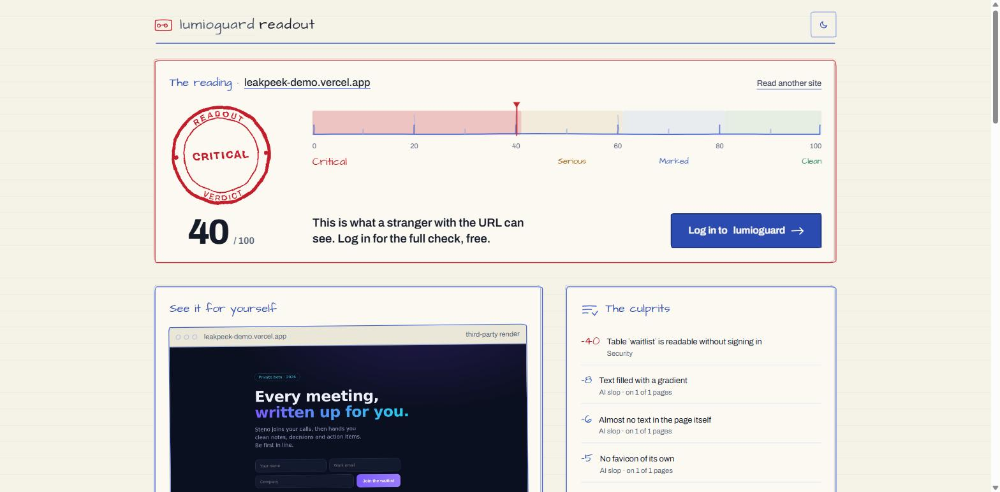
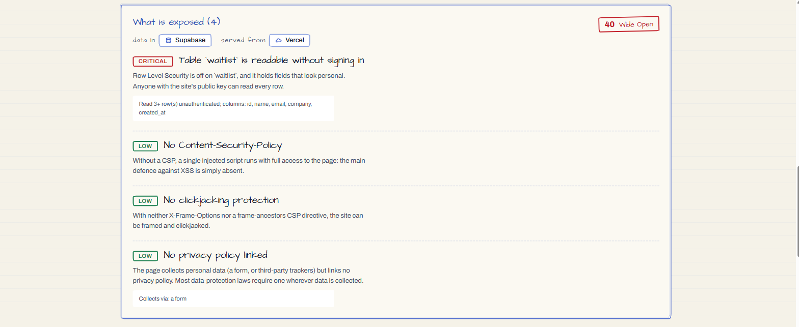
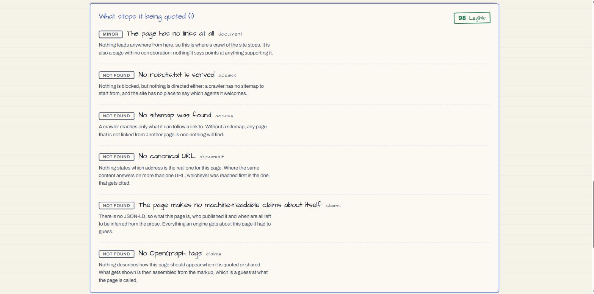

# LumioGuard Tools

Paste a public URL and get three independent readings of what the site actually
serves:

- **Slopmeter** finds visual, structural, and verbal defaults left in a generated
  or templated site.
- **Leakpeek** checks what the page, its bundles, and its public backend expose
  without signing in.
- **Citecheck** checks whether answer-engine crawlers can reach, understand, and
  quote the served content.

The tools need no repository access, database connection, installed agent, or
account. They inspect the public site from the outside.


## One report

All scores run from 0 to 100, with higher being better. When several readings
run together, the report uses the lowest score as its verdict. It does not
average them: a clean design reading cannot cancel an exposed database.

Findings from different tools are ranked together by how many points they cost.
Each tool then gets its own section, score, evidence, and vocabulary.

[](apps/console)

## The readings

### Slopmeter

Slopmeter crawls the site and looks for defaults that repeatedly appear in
generated pages: familiar gradient treatments, interchangeable card layouts,
placeholder copy, dead navigation, stock component choices, builder residue,
and unfinished metadata.

Every scored tell includes its evidence and cost. The engine judges published
output, not who made it. Hosting on Vercel or Netlify costs nothing; visible
generator artifacts may score because they are part of the page.

[](tools/slopmeter)

[Read the Slopmeter documentation](tools/slopmeter)

### Leakpeek

Leakpeek reads the document and JavaScript bundles, then follows supported
public client configuration to the application's backend. It detects exposed
secrets, reachable source maps, public environment files, weak response headers,
privacy problems, and Supabase tables readable without authentication.

Its probes are read-only. Reports include enough structure to prove a finding,
such as a row count and column names, but never returned row values.

[](tools/leakpeek)

[Read the Leakpeek documentation](tools/leakpeek)

### Citecheck

Citecheck reads beyond the home page and compares what a browser receives with
what a recognised crawler receives. It finds empty client-rendered shells,
blocking directives, bot filtering, contradictory crawler instructions, broken
metadata, and document structure that machines cannot use reliably.

The tool measures access to served content. It does not predict rankings or
promise that an answer engine will cite the site. Deliberately blocking a
crawler is reported as a policy choice; contradictions and broken signals are
the defects that cost points.

[](tools/citecheck)

[Read the Citecheck documentation](tools/citecheck)

## Use the hosted version

The public console is at [lumioguard.dev/tools](https://lumioguard.dev/tools).

| Path | Reading |
|---|---|
| `/` | Choose one or more tools |
| `/scan` | Run the selected tools together |
| `/ai-slop-check` | Slopmeter only |
| `/security-check` | Leakpeek only |
| `/seo-ai-visibility-check` | Citecheck only |

For a safe test target, use
[leakpeek-demo.vercel.app](https://leakpeek-demo.vercel.app/). It is deliberately
vulnerable and appears in the screenshots above.

Only scan sites you own or have permission to assess. Leakpeek makes real
read-only requests to public backends discovered in a site's bundles. See
[SECURITY.md](SECURITY.md) before scanning third-party infrastructure.

## Run locally

Requirements: Node 22 or newer and pnpm 9 or newer.

```bash
git clone https://github.com/lumioguard-dev/lumioguard-tools.git
cd lumioguard-tools
pnpm install
pnpm dev
```

No API key or external account is required.

| Service | Address |
|---|---|
| Console | `http://127.0.0.1:5200` |
| Slopmeter API | `http://127.0.0.1:8810` |
| Leakpeek API | `http://127.0.0.1:8820` |
| Citecheck API | `http://127.0.0.1:8830` |

## Repository layout

```text
apps/console/                 shared React and Vite front end
  src/tools/<tool>/           tool-specific client, report, and theme
packages/shared/              domain vocabulary and wire contracts
packages/design-tokens/       colour, type, spacing, and Tailwind output
packages/ui/                  shared interface components
packages/api-core/            Worker transport and safe target resolution
packages/web-core/            browser transport and analytics
tools/<tool>/core/            pure detection engine
tools/<tool>/api/             Cloudflare Worker
```

Detection engines contain no network or filesystem I/O. Workers fetch and map
results; the console renders them. A tool's private rule pack never enters the
browser bundle or crosses an API response.

All workspace packages are private. Releases publish source and deployable
Workers, not npm packages.

## Work on the project

[CONTRIBUTING.md](CONTRIBUTING.md) covers setup, testing, adding a tool, local
configuration, and deployment. Engineering constraints live in
[CLAUDE.md](CLAUDE.md).

[The generated rule catalogue](.documentation/RULES.md) lists every current
check in plain language. After changing a detector, run `pnpm rules`; CI verifies
the file with `pnpm rules:check`.

## Licence

MIT. See [LICENSE](LICENSE).
