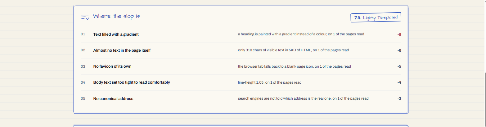

# Slopmeter

Slopmeter measures how much of a published site still looks, reads, and behaves
like the template that produced it.

It crawls several pages, runs a transparent rule set, and returns the evidence
behind every scored tell. It is one of the readings shown in the shared
[Readout console](../../apps/console).



## Score

The score runs from 0 to 100, with higher being better.

| Tier | Score | Meaning |
|---|---|---|
| Handmade | 81-100 | Almost nothing here comes out of a box |
| Lightly Templated | 61-80 | Mostly deliberate, with recognisable defaults |
| Heavily Templated | 41-60 | Untouched defaults shape much of the result |
| Slop | 0-40 | Stock choices dominate the page |

The engine subtracts penalties from 100. Evidence of deliberate work can return
some points, but credits cannot erase more than half of the penalties. Every
finding exposes its own weight so the result can be checked rather than trusted
blindly.

## What counts

Slopmeter judges published output, not the author's identity or workflow.

It checks copy, typography, colour, composition, component defaults, document
quality, visible builder residue, working navigation, and signs of manual craft.
A hand-coded page full of defaults may score poorly; a carefully designed page
made with a builder may score well.

Builder residue can cost points when it remains in the output. Examples include
generator metadata, builder-specific attributes, attribution badges, and
builder-hosted addresses. Ordinary hosting provenance, including Vercel and
Netlify, is reported without affecting the score.

The generated [rule catalogue](../../.documentation/RULES.md) contains the
current list of checks.

## How pages are read

The engine parses HTML with `linkedom`; it does not search raw markup with one
large regular expression. Structural rules inspect the parsed tree, which keeps
text inside scripts from masquerading as visible content.

Rules that can use a page's own CSS inspect inline styles and inline `<style>`
blocks as well as familiar utility classes. They deliberately do not search an
entire linked bundle. Compiled styles often contain components the page never
renders, which would create findings with no visible evidence.

## Limits and confidence

Slopmeter does not execute JavaScript. A client-rendered application may be read
as an empty shell. The API records `caveats.isClientRendered`, but the console
does not yet display that caveat.

A crawl covering fewer than `EVIDENCE_FLOOR_PAGES` pages is marked
`provisional`. The score still reports what the rules found, but the interface
does not present its tier as a confident placement of the whole site. This flag
measures crawl breadth, not whether each page contained a complete server render.

Linked CSS bundles remain outside the fallback described above. Closing that
gap requires evidence from a rendered DOM, not broader pattern matching.

## Rule-pack boundary

The rule pack is private implementation data. Rule ids, categories, definitions,
and the complete weight table do not cross the API boundary. The response carries
only the finding label, evidence needed by the report, and the cost assigned by
the server.

The console never imports `@lumioguard/slopmeter-core`. Wire-boundary tests guard
against accidentally serialising a domain object with private fields.

## Run locally

Start the whole product:

```bash
pnpm install
pnpm dev
```

Or run only the Worker and shared console:

```bash
pnpm --filter @lumioguard/slopmeter-api dev
pnpm --filter @lumioguard/console dev
```

The console is at `http://127.0.0.1:5200`; the Worker is at
`http://127.0.0.1:8810`. Use the Slopmeter page or add `?tools=slopmeter` to the
scan URL.

```text
POST /api/crawl  { "url": "example.com", "maxPages": 15, "depth": 2 }
POST /api/scan   { "url": "example.com" }
GET  /api/health
```

## Package layout

```text
core/
  analysis/      parsed document and style evidence
  rules/         definitions, weights, and registry
  scoring/       findings to score, tier, and headline
  crawl/         bounded traversal and site roll-up
api/
  Cloudflare Worker responsible for fetching, screenshots, and time
```

Shared contracts and domain terms live in `@lumioguard/shared`. The console
surface lives in `apps/console/src/tools/slopmeter`.

## Parity suite

The core can compare its scores with the earlier JavaScript detector using a
cached external corpus. Set `SLOPMETER_PARITY_ROOT` to that corpus to enable the
suite. Without it, parity tests skip.

Matches are exact. A mismatch means scoring changed, even if the edit looked
structural. Do not alter fixtures solely to make the suite pass.

## Configuration

| Variable | Used by | Default |
|---|---|---|
| `ALLOWED_ORIGINS` | Worker | `*` during development |
| `SLOPMETER_INGEST_SECRET` | Worker | unset; no reading is recorded |
| `LUMIOGUARD_API_BASE_URL` | Worker | unset; required with the ingest secret |
| `VITE_SLOPMETER_API_URL` | Console | relative local proxy |
| `VITE_LUMIOGUARD_APP_URL` | Console | unset; no hand-off or branding |
| `VITE_POSTHOG_KEY` | Console | unset; analytics disabled |
| `SLOPMETER_PARITY_ROOT` | Tests | unset; parity skipped |

All variables are optional for local use. See `api/.dev.vars.example` and
`../../apps/console/.env.example`.

## Principles

1. Score observable output, not presumed authorship.
2. Show the evidence and arithmetic behind the verdict.
3. Test rules against pages that should match and pages that must not.
4. Keep the detector server-side and the engine free of I/O.
